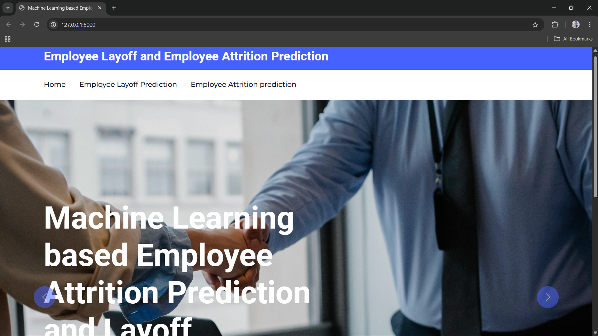
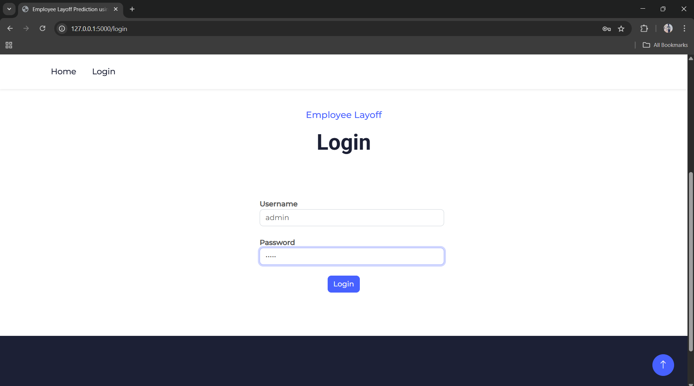
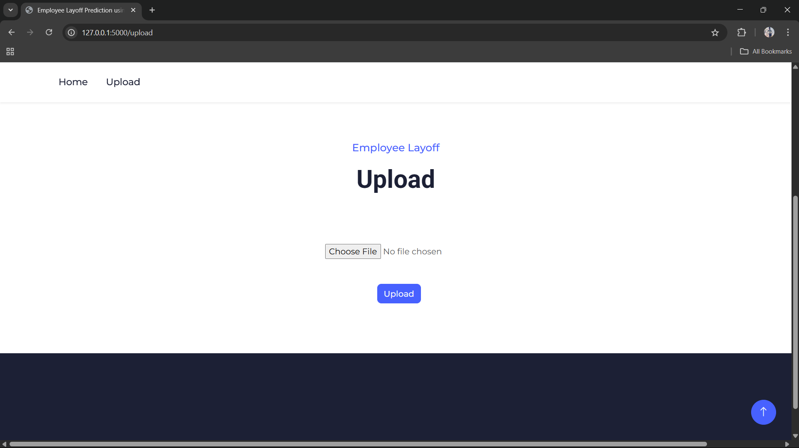
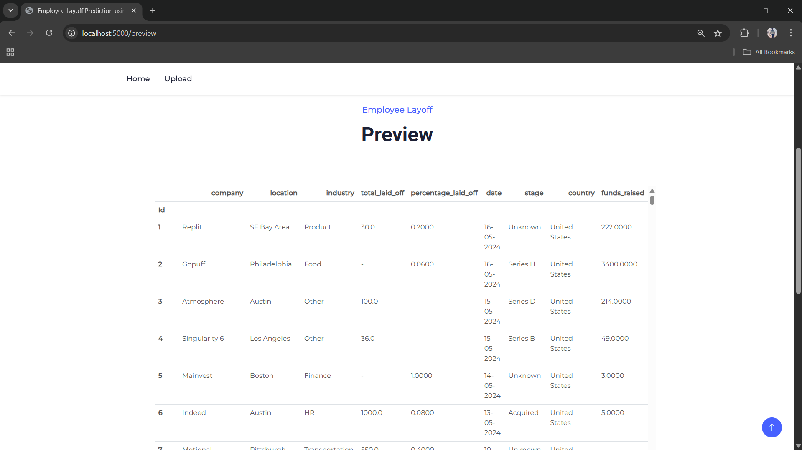
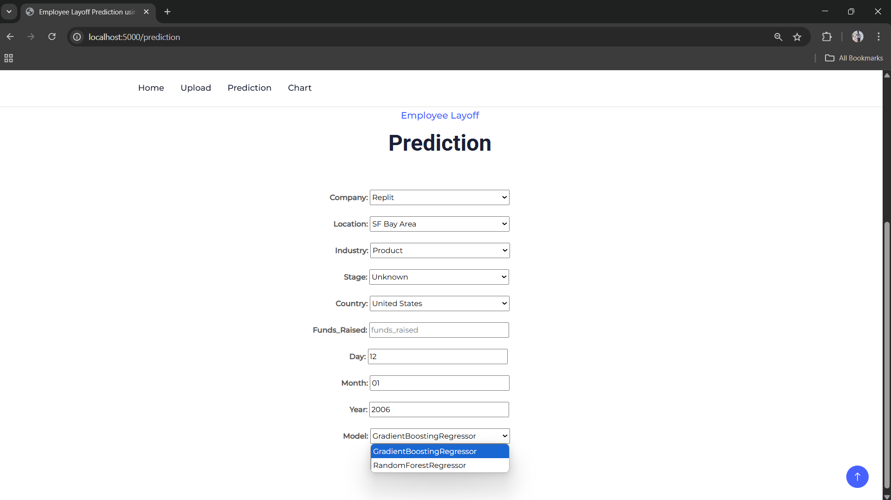
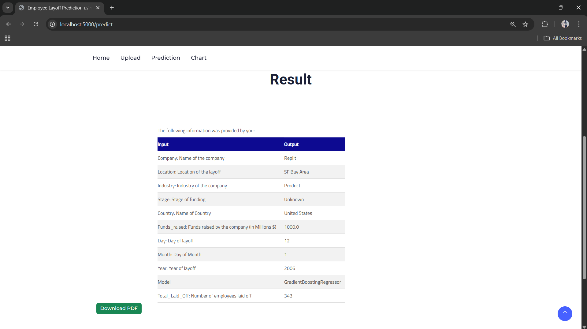
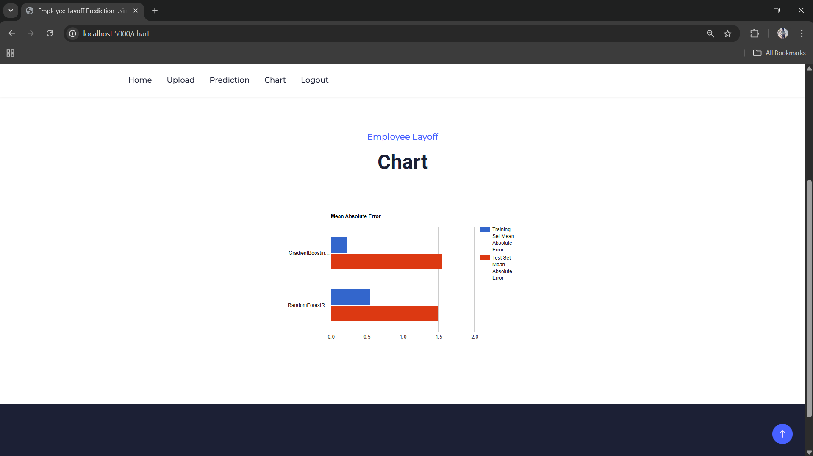

# Employee Attrition & Layoff Prediction

[](https://colab.research.google.com/github/manohar6317/Attrition_Layoff_Prediction/blob/main/Attrition_Layoff_Prediction.ipynb)

This repository contains a project focused on predicting employee attrition (voluntary departures) and potential layoffs (involuntary departures) within an organization. By leveraging machine learning techniques, this project aims to identify key factors contributing to employee turnover and provide insights that can help organizations proactively address these issues.

## Overview

* **Data Loading and Exploration:** Loading relevant employee data and performing exploratory data analysis (EDA) to understand the dataset, identify patterns, and visualize key relationships.
* **Feature Engineering:** Creating new features or transforming existing ones to improve the performance of the prediction models. This might involve handling categorical variables, scaling numerical features, or creating interaction terms.
* **Model Building and Training:** Implementing and training various machine learning models suitable for binary classification tasks (predicting whether an employee will leave or stay, or whether a layoff is likely). Common models include Logistic Regression, Support Vector Machines, Random Forests, Gradient Boosting, etc.
* **Model Evaluation:** Evaluating the performance of the trained models using appropriate metrics such as accuracy, precision, recall, F1-score, and AUC.
* **Interpretation and Insights:** Analyzing the model results to identify the most important factors influencing attrition and potential layoffs.


## Screenshots

**Home page**



**Login Page**



**upload Page**



**preview Page**



**prediction Page**



**result Page**



**chart Page**




## Repository Contents

* **`README.md`:** This file, providing an overview of the project and instructions for understanding and potentially running the code.
* **`/data` (Optional):** This directory might contain the dataset(s) used for training and testing the models. If the data is sensitive or proprietary, it might not be included in the repository and instructions on how to obtain or use it would be provided here.
* **`/models` (Optional):** This directory could store any saved trained models for later use or deployment.
* **`/reports` (Optional):** This directory might contain reports or visualizations generated during the analysis.

## Getting Started

To run and explore this project, you will need to have the following installed:

* **Python 3.12.0**
* **Required Python Libraries:** You can install the necessary libraries using pip. It's recommended to create a virtual environment to manage dependencies.Install the following

    ```bash
    pip install scikit-learn==1.5.0
    ```
  ```bash
    pip install flask==3.0.3
    ```
  ```bash
    pip install pandas==2.2.2
    ```
  ```bash
    pip install numpy==1.26.4
    ```

## Usage

1.  **Download th ZIP File:**

2.  **Navigate to the Parent Directory: Run the Following Command**
    ```bash
    python app.py
    ```

3.  **Use the available datasets provided in zip file for testing:** 

4.  **Explore the results:** Analyze the output  to understand the model's predictions and the insights derived from the analysis.

## Potential Improvements and Future Work

* **Feature Importance Analysis:** Further investigate and visualize the importance of different features in predicting attrition and layoffs.
* **Advanced Modeling Techniques:** Explore more sophisticated machine learning models, such as deep learning algorithms, to potentially improve prediction accuracy.
* **Hyperparameter Tuning:** Implement techniques like GridSearchCV or RandomizedSearchCV to optimize the hyperparameters of the chosen models.
* **Deployment:** Consider how the trained model could be deployed for real-time prediction and integration into HR systems.
* **Explainable AI (XAI):** Implement methods to make the model predictions more interpretable and understandable for stakeholders.
* **Handling Imbalanced Data:** If the dataset has an imbalanced distribution of attrition/layoff cases, explore techniques to address this issue (e.g., oversampling, undersampling, cost-sensitive learning).
* **Incorporating External Factors:** Explore the possibility of incorporating external economic or industry-specific data that might influence attrition and layoffs.

## Contributing

Contributions to this project are welcome. If you have suggestions for improvements, bug fixes, or new features, please feel free to open an issue or submit a pull request.


---

